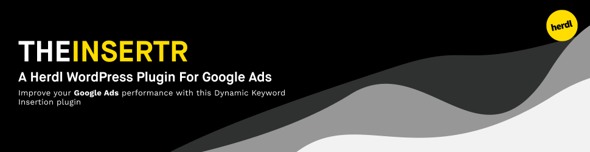

[](https://github.com/herdl/the-insertr)
[](https://github.com/herdl/the-insertr)
[](https://github.com/herdl/the-insertr/graphs/commit-activity)
[](https://github.com/herdl/the-insertr/releases/)
[](http://makeapullrequest.com)
[](https://github.com/herdl)

# The Insertr
Wordpress dynamic keyword insertion plugin.

## Prerequisites
The following is a list of prerequisites for The Insertr.
```
PHP Version >= 7.0.0
```

### Installation

You can download the latest release as a `.zip` then head over to your site to install this manually.

Alternatively you can install it via the [Wordpress marketplace](https://wordpress.org/plugins/the-insertr/).

## Description

The Herdl dynamic keyword insertion plugin, The Insertr, dynamically inserts a keyword onto your page using a simple URL query string to determine the keyword and a shortcode for placement.

The placement of the word or phrase is determined by the location of the short code. In the case where a word is not specified a fallback Keyword or phrase is placed instead.

## Usage

Short code to be used: `[insertr key=”{desiredword}” fallback=”{fallback}”]` where ‘desiredword’ is the word to be placed, and ‘fallback’ is the word to appear if no keyword is specified.

For the Keyword to be placed on your page, you must also add the following parameter to your URL: ?keyword={example} Where ‘example’ is the word you want to placed.

If your URL already has parameters (E.g – there is already a ? in the URL) add &keyword={keyword} to the end of the string.

You can also specify the fallback case by doing the following

`[insertr key=”{desiredword}” fallback=”{fallback}” case="upper"]`

There are 3 case options `upper`, `lower` and `title`. The default value for this is `lower`.

## Use Cases
– Improving the landing page experience for Google Ads performance by improving keyword relevancy
– Personalisation of pages
– Marketing automation

## We're Using
* [PHP](https://www.php.net/) - The primary programming language

## Contributing
It is worth noting that all contributions must comply with the [PSR-2 standards](https://github.com/php-fig/fig-standards/blob/master/accepted/PSR-2-coding-style-guide.md)

## Versioning
We use [SemVer](http://semver.org/) for versioning. For the versions available, see the [tags on this repository](https://github.com/herdl/the-insertr/tags). 

## Authors
* **Alex Blackham** - *Developer and Maintainer* - [B3none](https://github.com/b3none)
* **Mat Moses** - *Logo creation* - [mooonthemove](https://instagram.com/mooonthemove)

See also the list of [contributors](https://github.com/herdl/the-insertr/contributors) who participated in this project.

## License
This project is licensed under the MIT License - see the [LICENSE.md](LICENSE.md) file for details
